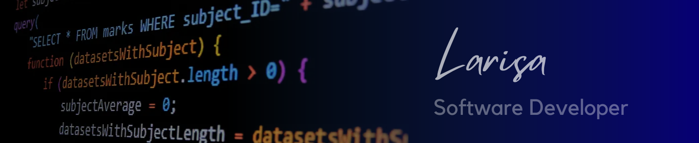

## Hi! 👋 I'm Larisa - a Software Developer 👩🏽‍💻 with a business background💼.

## ⚒️ Tech Stack 

  
  
  
  
  
  
  
  
  
  
  
  
  
  
  
  
  
  
  
  
  
  

 

- **Programming Languages:** JavaScript, TypeScript, Java, Python, HTML5, CSS, SCSS, Bash scripting
- **Libraries & Frameworks:** React, Bootstrap, JQuery, Zod, Redux, Tailwind, Material-UI, Chakra-UI
- **Runtime Environments:** Node, Deno
- **Building & Testing Tools:** Vite, Webpack, Jest, React Testing Library
- **DevOps & Cloud Platforms:** Docker containers, GitHub Actions, Amazon AWS

## 😋 Spoken Languages 
- **English** - Advanced (C1, fluent)
- **Finnish** - Intermediate (B1)
- **Polish** - Elementary (A2)
- **Ukrainian, Russian** - Native

## 📊 Profile Statistics
 

## 📝 Dev Quote

